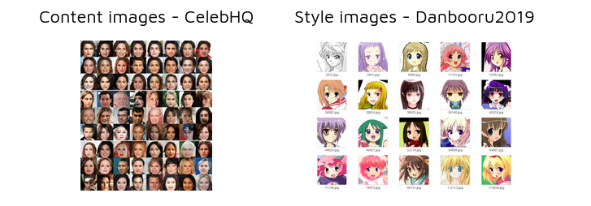
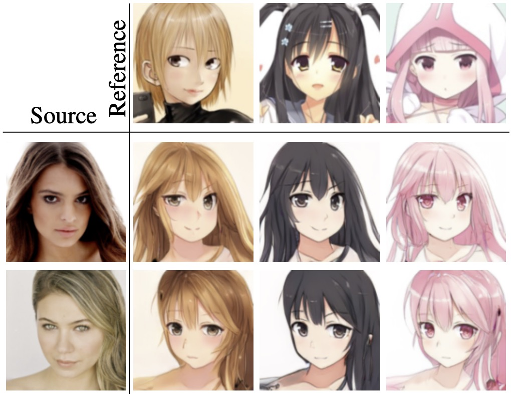
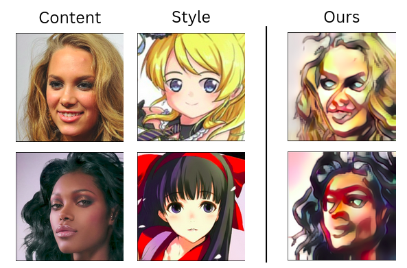
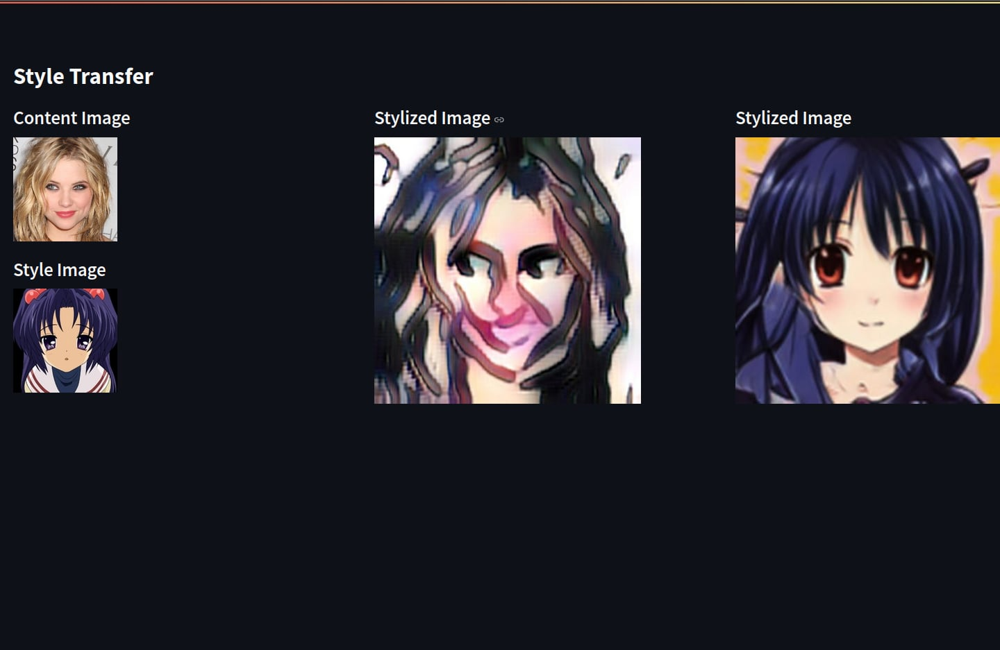

<p align="center">
  <a href="https://www.uit.edu.vn/" title="Trường Đại học Công nghệ Thông tin" style="border: 5;">
    
  </a>
</p>

<!-- Title -->
<h1 align="center"><b>CS431.P11 - Các kĩ thuật học sâu và ứng dụng</b></h1>


## GIỚI THIỆU

<a name="gioithieumonhoc"></a>

- **Tên môn học**: Các kĩ thuật học sâu và ứng dụng
- **Đề tài**: Some method for Anime-Face-Converter 
- **Mã môn học**: CS431.P11
- **Năm học**: 2024-2025

## GIẢNG VIÊN HƯỚNG DẪN

<a name="giangvien"></a>

- Ths **Nguyễn Vinh Tiệp**

## THÀNH VIÊN NHÓM

<a name="thanhvien"></a>
| STT | MSSV | Họ và Tên | Github | Email |
| ------ |:-------------:| ----------------------:|-----------------------------------------------------:|-------------------------:
| 1 | 22520914 | Nguyễn Hải Nam |[NamSee04](https://github.com/NamSee04) |22520914@gm.uit.edu.vn |
| 2 | 22520750 | Trương Quang Lập |[Laptq201](https://github.com/Laptq201) |22520750@gm.uit.edu.vn |
| 3 | 22520673 | Lê Hữu Khoa |[kevdn](https://github.com/kevdn) |22520673@gm.uit.edu.vn |
| 4 | 22520915 | Nguyễn Hồ Nam |[Honam0905 ](https://github.com/Honam0905) |22520915@gm.uit.edu.vn |


## THAM KHẢO

<a name="thamkhao"></a>

- Phần thực nghiệm của phương pháp AniGAN được lấy từ: [AniGAN](https://github.com/bing-li-ai/AniGAN)
- Đối với phương pháp StyleTransfer, đoạn code được thực hiện hóa dựa trên repo: [Pytorch-Adaptive-Instance-Normalization](https://github.com/CellEight/Pytorch-Adaptive-Instance-Normalization)

## CÀI ĐẶT

```
conda create -n Demo python=3.11
conda activate Demo
pip install -r requirments.txt 
```

## MODEL

- Tải trọng số đã được huấn luyện trước từ [Google Drive](https://drive.google.com/file/d/1xw2aB4Tw3Qo5C8OKVN6DlkEZwmS9N9Vj/view?usp=sharing)
- Đối với phương pháp Style Transfer, nhóm tiến hành huấn luyện lại và đặt file trọng số vào `Anime-Face-Converter/StyleT/src/ckpt`
- Đối với phương pháp AniGAN, nhóm sử dụng trọng số đã được huấn luyện trước của tác giả và đặt file trọng số vào `Anime-Face-Converter/AniGan/src/checkpoints`


## DATASETS

Sử dụng **face2anime** dataset. Tập dữ liệu **face2anime** chứa tổng cộng 17,796 hình ảnh, trong đó số lượng cả khuôn mặt anime và khuôn mặt tự nhiên là 8,898. Các khuôn mặt anime được thu thập từ tập dữ liệu Danbooru2019, chứa nhiều nhân vật anime với nhiều phong cách anime khác nhau. Đối với khuôn mặt tự nhiên, chọn ngẫu nhiên 8,898 khuôn mặt nữ từ tập dữ liệu CelebA-HQ. Tất cả các hình ảnh đều được căn chỉnh với các điểm đặc trưng trên khuôn mặt và được cắt thành kích thước 128 × 128. Dataset được chia  thành một tập huấn luyện với 8,000 hình ảnh và một tập kiểm tra với 898 hình ảnh.

Bạn có thể tải tập dữ liệu **face2anime** từ [Google Drive](https://drive.google.com/file/d/1Exc6QumR2r0aFUtfHOdAgle4F4I9zwF3/view?usp=sharing).

<p align="center"> 
  
</p>

## TESTING

### Đối với AniGAN

```
cd AniGan

python test.py \
    --source_img SOURCE_IMG_PATH \
    --reference_img REFERENCE_IMG_PATH \
    --output_dir SAVE_PATH
```

- `SOURCE_IMG_PATH`: Đường dẫn đến ảnh chứa mặt anime.
- `REFERENCE_IMG_PATH`: Đường dẫn đến ảnh chứa mặt thật.

<p align="center"> 
  
</p>

### Đối với StyleTransfer

```
cd StyleT

python test.py \
    --content  \
    --style  \
    --vgg  \
    --decoder 
```

- `--content`: Đường dẫn đến ảnh khuông mặt thật.
- `--style`: Đường dẫn đến ảnh chứa animes
- `--vgg`: Đường dẫn đến vgg weight.
- `--decoder`: Đường dẫn decoder weight.

<p align="center"> 
  
</p>

## TRAINING

### Đối với Style Transfer

```
cd StyleT

python src/train.py 
```

* Nhớ chỉnh các path trong `scr/train.py`

## EVALUATE FOR STYLE TRANSFER USING FID

```
cd StyleT

python evaluate.py
python -m pytorch_fid output_folder_path imgs_test_path --device cuda:1
```

- `output_folder_path`: Đường dẫn đến thư mục đầu ra.
- `imgs_test_path`: Đường dẫn đến thư mục chứa ảnh kiểm tra.

## WEB UI

### Run backend

```bash
uvicorn app:app --reload
```

### Run frontend

```bash
streamlit run streamlit_app.py
```

Mở [http://localhost:8501/](http://localhost:8501/)

* Lưu ý chỉnh các đường dẫn của model trong `app.py`

<p align="center"> 
  
</p>